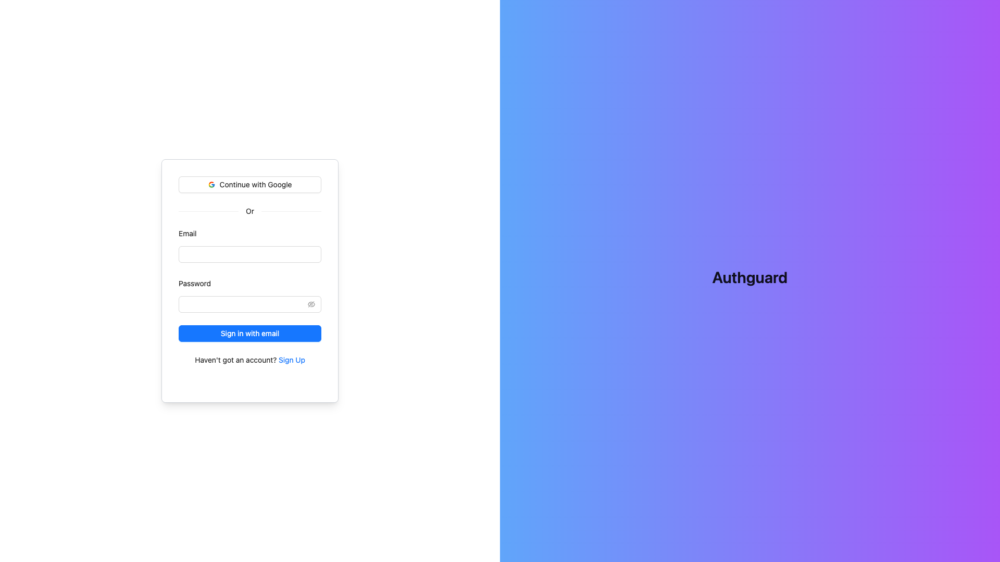
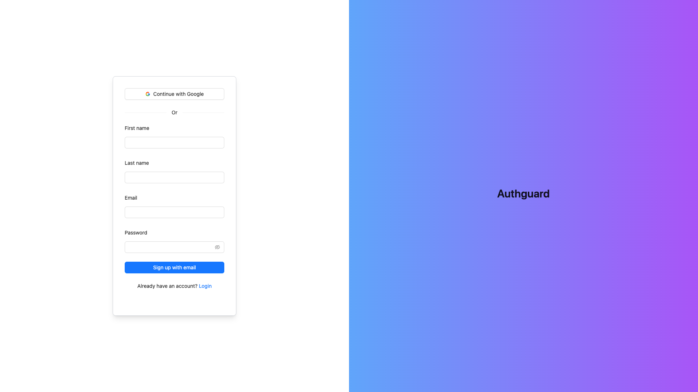
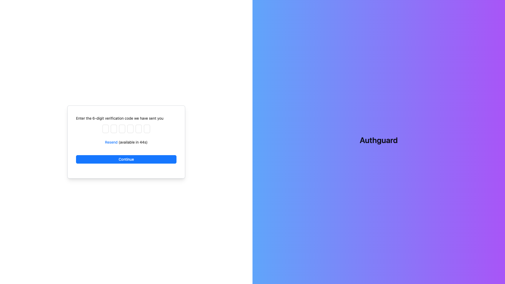

# AuthGuard

A drop-in authentication and account management microservice. Handles user registration, login, MFA, SSO, and session management so your apps don't have to.

## Architecture

```
client/   React 18 + Ant Design + Tailwind CSS + Vite
server/   Express.js + TypeScript + MongoDB + Mongoose
```

## Features

- **Email/Password Auth** with bcrypt hashing (14 salt rounds) and Zod validation
- **Multi-Factor Authentication** via email with 6-digit codes, rate limiting, and cooldown
- **SSO** with Google and Microsoft via OpenID Connect + PKCE
- **Session Management** with JWT (ES256), key rotation, and TTL-based expiry
- **Account Linking** for connecting multiple SSO providers to one account

## API Endpoints

| Method | Endpoint | Description |
|--------|----------|-------------|
| `POST` | `/auth/signin` | Email/password login |
| `POST` | `/auth/signup` | Registration |
| `DELETE` | `/auth/signout` | Logout |
| `GET` | `/auth/signin/sso/{provider}` | OAuth redirect (Google, Microsoft) |
| `GET` | `/auth/signin/sso/{provider}/callback` | OAuth callback |
| `POST` | `/auth/mfa/challenge` | Get MFA challenge details |
| `POST` | `/auth/mfa/challenge/send` | Send/resend MFA code |
| `POST` | `/auth/mfa/challenge/verify` | Verify MFA code |
| `GET` | `/users/me` | Current user info |
| `GET` | `/users/me/linked-accounts` | List linked SSO accounts |
| `DELETE` | `/users/me/linked-accounts/{provider}` | Unlink SSO account |
| `GET` | `/users/me/sessions` | List active sessions |
| `DELETE` | `/users/me/sessions/{id}` | Revoke a session |

Full OpenAPI spec available at `/api/accounts/docs` when running in development.

## Screenshots

| Login | Sign Up | MFA Verification |
|-------|---------|------------------|
|  |  |  |

## Security

- **Password hashing**: bcrypt with 14 salt rounds
- **MFA codes**: bcrypt-hashed, 10 failed attempts triggers 15-minute cooldown
- **Tokens**: ES256 (ECDSA) with dual-key rotation for access tokens
- **OAuth**: PKCE flow with state validation
- **Sessions**: 90-day TTL with automatic MongoDB cleanup

## Tech Stack

**Server**: Express.js, TypeScript, MongoDB, Mongoose, Jose (JWT), AWS SES, OpenID Connect

**Client**: React 18, Ant Design, Tailwind CSS, React Hook Form, Zod, Axios, Vite

**Infrastructure**: Docker, Kubernetes, Skaffold, NGINX Ingress

## Running Locally

### Prerequisites
- Node.js 18+
- pnpm
- MongoDB (or use the K8s setup)

### Client
```bash
cd client
pnpm install
pnpm dev
```

### Server
```bash
cd server
pnpm install
# Set required environment variables (see server/src/config/config.ts)
pnpm start
```

The client proxies `/api` requests to `localhost:3000` in development.

## License

ISC
